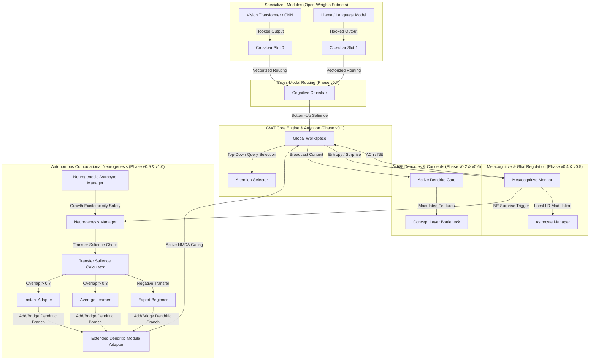

# GWT: Global Workspace Theory Cognitive Augmentation Library

[](https://pypi.org/project/cognitive-aug/)
[](https://www.gnu.org/licenses/gpl-3.0)
[](https://github.com/)
[](https://colab.research.google.com/drive/1fPsPn24tqG-46bC9cAJqpMOmW9vecuoz?usp=sharing)

An enterprise-grade, lightweight, and mathematically rigorous PyTorch cognitive augmentation library. Based on the cognitive science principles of **Global Workspace Theory (GWT)**, active dendritic processing, metacognitive neuromodulation, and glial homeostasis, GWT enables developers to augment any **open-weights foundation model** (such as Llama-3, Mistral, ResNet, and Vision Transformers) with state-of-the-art brain-inspired routing, active gating, and local learning regulation.

---

## 1. Package Executive Overview & Installation

### Architectural Overview
The GWT library acts as a framework-agnostic, low-overhead cognitive layer that hooks into PyTorch models (Transformers, CNNs, and Spiking Neural Networks) without requiring intrusive alterations to their source code. By leveraging PyTorch forward and backward hooks, GWT intercepts intermediate representations, routes them through a central workspace bottleneck where they compete for attention, and broadcasts a unified cognitive context vector back to all subsystems.



### Key Biological Paradigms
1. **Global Workspace Bottleneck (Phase v0.1)**: Collapses high-dimensional representation spaces into a selective, low-dimensional competitive broadcast.
2. **Active Dendritic Gating (Phase v0.2)**: Simulates compartmental dendritic trees where GWT context filters and modulates feedforward inputs via NMDA-like threshold spiking.
3. **Episodic Consolidation & Synaptic Homeostasis (Phase v0.3)**: Executes offline sleep-replay cycles and permanently prunes underutilized synapses using backward gradient lockout hooks.
4. **Metacognitive Neuromodulation (Phase v0.4)**: Automatically tunes hyperparameter knobs based on temporal cosine surprise (Norepinephrine) and entropy focus (Acetylcholine).
5. **Glial Metaplasticity & Excitotoxicity Protection (Phase v0.5)**: Employs virtual astrocytes to scale local learning rates and damps excessive gradient variance locally.
6. **Conceptual Bottlenecks & Causal Interventions (Phase v0.6)**: Maps representations onto explicit concept activation scores in $[0, 1]$, enabling human-in-the-loop causal overrides.
7. **Cross-Modal Cognitive Crossbar (Phase v0.7)**: Routes information concurrently across multiple parallel slots using multi-slot attention routing.
8. **Enterprise Scalability & Caching (Phase v0.8)**: Offloads heavy SWS consolidation loops asynchronously and serializes/deserializes PyTorch activation tensors to/from Redis Enterprise.
9. **Autonomous Computational Neurogenesis (Phase v0.9)**: Dynamically spawns new parallel dendritic branches in response to high unexpected uncertainty, protected by somatic calcium regulators and offline pruning consolidation.
10. **Positive/Negative Transfer Learning (Phase v1.0)**: Employs a `TransferSalienceCalculator` to measure cross-domain overlap, enabling Fast (Instant Adapter), Hybrid (Average Learner), and Slow (from scratch) learning modes while suppressing negative transfer interference.
11. **Integrated Information Theory Monitor (Phase v1.1)**: Dynamically calculates the system irreducibility (Phi / Φ) by measuring Cosine Distance between full and partitioned workspace attention graphs, simulating the mathematical Minimum Information Partition (MIP) causal cut.

---

### Installation

Install the library directly from PyPI or within your development workspace using **pip** or **Poetry**:

#### Standard pip environment
```bash
pip install cognitive-aug
```

#### Development & Editable Mode
```bash
git clone https://github.com/foxprint666/cognitive-layer.git
cd cognitive-layer
pip install -e ".[dev]"
```

#### poetry installation
```bash
poetry add cognitive-aug
```

---

### Developer Quick-Start

The following script demonstrates how to instantiate the engine, register a simple PyTorch layer with a dendritic adapter, execute a forward and stepping loop, and print the live ASCII diagnostic panel:

```python
import torch
import torch.nn as nn
from cognitive_aug import (
    CognitiveAugEngine,
    GlobalWorkspace,
    DendriticModuleAdapter,
    MetacognitiveMonitor,
)

# 1. Define a standard PyTorch module
class VisionEncoder(nn.Module):
    def __init__(self) -> None:
        super().__init__()
        self.conv = nn.Conv2d(3, 8, kernel_size=3, padding=1)
        self.fc = nn.Linear(8 * 4 * 4, 16)

    def forward(self, x: torch.Tensor) -> torch.Tensor:
        out = torch.relu(self.conv(x))
        out = out.view(out.size(0), -1)
        return self.fc(out)

# 2. Instantiate modules and engine
device = torch.device("cuda" if torch.cuda.is_available() else "cpu")
model = VisionEncoder().to(device)

engine = CognitiveAugEngine()

# 3. Register standard module with a Dendritic Adapter
adapter = DendriticModuleAdapter(
    name="vision_encoder",
    module=model,
    latent_dim=16,
    data_flow=engine.data_flow,
    num_branches=4,
    spike_type="nmda-threshold",
    threshold=0.4
)
engine.registry.register("vision_encoder", adapter)

# 4. Attach Workspace and Neuromodulator
workspace = GlobalWorkspace(latent_dim=16, key_dim=32, ignition_threshold=0.3).to(device)
engine.attach_workspace(workspace)

monitor = MetacognitiveMonitor(alpha_ne=0.2, alpha_ach=0.2)
engine.attach_neuromodulator(monitor)

# 5. Run standard forward pass & step GWT cycle
inputs = torch.randn(4, 3, 4, 4, device=device)
outputs = model(inputs)  # Adapter automatically intercepts latents via hooks

broadcast_state = engine.step()  # Computes GWT routing and ACh/NE curves

print(f"[*] Broadcast Context Shape: {broadcast_state.shape}")
print(engine.inspect())  # Displays live terminal telemetry dashboard! (On Windows, you may need to set PYTHONIOENCODING=utf-8)
```

---

## 2. Exhaustive Feature API and Function Signature Blueprint

This section provides a rigorous class-by-class, method-by-method blueprint of the entire GWT library across all 7 architectural phases.

---

### Phase v0.1: Core Engine

Manages the core infrastructure including module registry, O(1) dynamic latent routing buffers, GWT workspace attention selection (top-down / bottom-up), and global broadcasting.

#### Class: `CognitiveAugEngine`
Main central orchestrator wrapping all GWT subsystems.

```python
class CognitiveAugEngine:
    def __init__(self) -> None: ...
    
    def register_module(
        self, 
        name: str, 
        module: torch.nn.Module, 
        latent_dim: int, 
        **kwargs: Any
    ) -> ModuleAdapter: ...
    
    def attach_workspace(self, workspace: torch.nn.Module) -> None: ...
    
    def attach_neuromodulator(self, monitor: Any) -> None: ...
    
    def attach_glial_manager(self, manager: Any) -> None: ...
    
    def attach_concept_layer(self, name: str, layer: Any) -> None: ...
    
    def attach_crossbar(self, crossbar: Any) -> None: ...
    
    def attach_replay_buffer(self, replay_buffer: Any) -> None: ...
    
    def step(self) -> torch.Tensor: ...
    """
    Executes one full GWT cycle:
    1. Collects modular buffers from DataFlowManager.
    2. Modulates parameters based on chemical levels.
    3. Runs CognitiveCrossbar message passing (if attached).
    4. Computes Workspace routing and broadcasts the unified state [B, latent_dim].
    """
    
    def inspect(self) -> str: ...
    """Renders a beautiful ASCII diagnostic report of all subcomponents."""
```

#### Class: `ModuleRegistry`
Manages a mapping of unique names to registered module adapters.

```python
class ModuleRegistry:
    def __init__(self) -> None: ...
    def register(self, name: str, adapter: Any) -> None: ...
    def get(self, name: str) -> Any: ...
    def list_names(self) -> List[str]: ...
    def list_adapters(self) -> List[Any]: ...
    def clear(self) -> None: ...
```

#### Class: `DataFlowManager`
Implements high-performance transient buffers and salience metrics.

```python
class DataFlowManager:
    def __init__(self) -> None: ...
    def update_buffer(self, name: str, tensor: torch.Tensor) -> None: ...
    def get_buffer(self, name: str) -> torch.Tensor: ...
    def list_buffers(self) -> Dict[str, torch.Tensor]: ...
    def update_salience(self, name: str, score: float) -> None: ...
    def get_salience(self, name: str) -> float: ...
    def list_saliences(self) -> Dict[str, float]: ...
    def clear_buffers(self) -> None: ...
```

#### Class: `GlobalWorkspace`
The core GWT competitive bottleneck module.

```python
class GlobalWorkspace(torch.nn.Module):
    def __init__(
        self,
        latent_dim: int,
        key_dim: int = 64,
        attention_type: str = "key-query",
        selection_mode: str = "soft",
        ignition_threshold: float = 0.0,
        workspace_slots: int = 1,
    ) -> None: ...
    
    def forward(
        self,
        latent_states: Dict[str, torch.Tensor],
        keys: Dict[str, torch.Tensor],
        custom_query: Optional[torch.Tensor] = None,
    ) -> torch.Tensor: ...
    """
    Args:
        latent_states : Map of name -> [B, latent_dim] latents.
        keys          : Map of name -> [B, key_dim] key representations.
        custom_query  : Optional query representation override [B, key_dim].
    Returns:
        Unified GWT broadcast state [B, latent_dim].
    """
```

---

### Phase v0.2: Active Dendrites

Simulates biologically plausible dendritic gating where global context modulates localized feedforward outputs.

#### Class: `ActiveDendriteGate`
Vectorized dendritic pre-processing module supporting NMDA spikes.

```python
class ActiveDendriteGate(torch.nn.Module):
    def __init__(
        self,
        feedforward_dim: int,
        context_dim: int,
        num_branches: int = 4,
        spike_type: str = "modulatory-gain",
        threshold: float = 0.5,
        gain_temperature: float = 1.0,
    ) -> None:
        """
        Args:
            feedforward_dim  : Dimension of raw feedforward inputs.
            context_dim      : Dimension of GWT broadcast context.
            num_branches     : Number of dendritic branches.
            spike_type       : Gating type: 'modulatory-gain' (sigmoid) or 'nmda-threshold' (STE step).
            threshold        : Spike threshold for NMDA gating.
            gain_temperature : Division factor scaling sigmoidal steepness.
        """
        ...

    def forward(self, x: torch.Tensor, context: torch.Tensor) -> torch.Tensor: ...
    """
    Computes modulated output shape matching x (supports [B, D] or [B, S, D]).
    """
    
    def get_status(self) -> Dict[str, float]: ...
    """Returns active_pct and muted_pct status maps based on latest activations."""
```

#### Class: `DendriticModuleAdapter`
Extends `ModuleAdapter` to automatically inject `ActiveDendriteGate` into the PyTorch forward pipeline.

```python
class DendriticModuleAdapter(ModuleAdapter):
    def __init__(
        self,
        name_or_module: Any = None,
        module: Optional[torch.nn.Module] = None,
        latent_dim: Optional[int] = None,
        data_flow: Optional[DataFlowManager] = None,
        num_branches: int = 4,
        spike_type: str = "modulatory-gain",
        key_dim: int = 64,
        projection_in_dim: Optional[int] = None,
        threshold: float = 0.5,
        name: Optional[str] = None,
        **kwargs: Any,
    ) -> None: ...
```

---

### Phase v0.3: Sleep/Memory

Handles slow-wave sleep memory consolidation and synaptic homeostasis.

#### Class: `CognitiveReplayBuffer`
Lightweight, O(1) bounded replay buffer storing high-salience experiences.

```python
class CognitiveReplayBuffer:
    def __init__(self, max_size: int = 1000) -> None: ...
    
    def add_trace(
        self,
        latent_states: Dict[str, torch.Tensor],
        context: torch.Tensor,
        salience: float,
    ) -> None: ...
    """
    Stores detached clones of inputs in O(1) time. 
    Evicts the lowest salience item when size exceeds max_size.
    """
    
    def sample_batch(self, batch_size: int) -> List[Dict[str, Any]]: ...
    
    def clear(self) -> None: ...
```

#### Class: `ConsolidationEngine`
Handles offline consolidation cycles minimizing combined reconstruction and stability losses.

```python
class ConsolidationEngine:
    def __init__(self, engine: Any, replay_buffer: CognitiveReplayBuffer) -> None: ...
    
    def sleep_cycle(
        self,
        steps: int = 100,
        learning_rate: float = 0.001,
        batch_size: int = 32,
    ) -> Dict[str, Any]: ...
    """
    Performs memory consolidation optimization loop. Returns summary statistics.
    """
```

#### Function: `prune_dendrites`
Executes structural pruning on under-utilized dendritic branches.

```python
def prune_dendrites(
    engine: Any,
    pruning_threshold: float = 0.05,
    waking_activations: Optional[Dict[str, torch.Tensor]] = None,
) -> int:
    """
    Locks out parameter gradient propagation permanently on pruned branches.
    Returns the total number of branches successfully pruned.
    """
```

---

### Phase v0.4: Neuromodulation

Self-tunes hyperparameters dynamically via Acetylcholine (ACh) and Norepinephrine (NE).

#### Class: `MetacognitiveMonitor`
Calculates dynamic chemical levels under strict `torch.no_grad()` scopes.

```python
class MetacognitiveMonitor:
    def __init__(
        self,
        alpha_ne: float = 0.8,
        alpha_ach: 0.8,
        beta: float = 0.5,
        gamma: float = 0.2,
        threshold_coef: float = 0.3,
        temp_coef: float = 0.5,
    ) -> None:
        """
        Args:
            alpha_ne       : Smoothing factor for NE surprise tracking.
            alpha_ach      : Smoothing factor for ACh focus tracking.
            beta           : Base baseline scaling for GWT ignition.
            gamma          : ACh scaling scale factor for GWT ignition.
            threshold_coef : Enforced NMDA spike threshold shift.
            temp_coef      : Enforced sigmoid gain sharpening.
        """
        ...
        
    def modulate(self, engine: Any) -> None: ...
    """Triggers chemical monitoring and executes threshold updates."""
    
    def get_chemical_levels(self) -> Dict[str, Any]: ...
    """Returns dynamic chemical statistics and gorgeous progress bars."""
```

#### Class: `DynamicThresholdAdapter`
Adapts thresholds of Global Workspace and Dendritic Gates in-place.

```python
class DynamicThresholdAdapter:
    def __init__(
        self,
        baseline_ignition: float = 0.5,
        baseline_dendrite: float = 0.5,
        threshold_coef: float = 0.3,
        temp_coef: float = 0.5,
        beta: float = 0.5,
        gamma: float = 0.2,
    ) -> None: ...

    def apply(self, engine: Any, ne: float, ach: float) -> None: ...
    """Performs dynamic parameter injection."""
```

---

### Phase v0.5: Glial Cell Regulation

Implements localized learning rate metaplasticity and gradient excitotoxicity protection.

#### Class: `AstrocyteManager`
Coordinates Tripartite Synapse learning scaling based on local salience EMA and global chemical states.

```python
class AstrocyteManager(torch.nn.Module):
    def __init__(
        self,
        ema_alpha: float = 0.9,
        lr_lock_scale: float = 0.5,
        lr_unlock_scale: float = 1.5,
        max_variance_threshold: float = 3.0,
        damping_factor: float = 0.2,
    ) -> None: ...
    
    def attach(self, engine: Any) -> None: ...
    
    def update(self, engine: Any) -> None: ...
    """Tracks running EMA of modular saliences."""
    
    def adjust_learning_rates(self, optimizer: torch.optim.Optimizer) -> None: ...
    """
    Dynamically scales optimizer param group learning rates:
    - Highly stable focused state (ACh high, NE low) -> scales down (lock-in) by lr_lock_scale.
    - Surprising/high-salience state (NE high) -> scales up (unlock) by lr_unlock_scale.
    """
```

#### Class: `GradientSanitizerHook`
Stops gradient explosions from propagating through the architecture.

```python
class GradientSanitizerHook:
    def __init__(
        self,
        max_variance_threshold: float = 3.0,
        damping_factor: float = 0.2,
    ) -> None: ...
    
    def register(self, parameter: torch.nn.Parameter) -> None: ...
    """Applies a standard PyTorch backward hook."""
    
    def remove_hooks(self) -> None: ...
```

---

### Phase v0.6: Concept Layer

Projects hidden representations into explicit conceptual labels, allowing targeted causal overrides.

#### Class: `ConceptLayer`
The low-dimensional concept bottleneck projector.

```python
class ConceptLayer(torch.nn.Module):
    def __init__(
        self,
        input_dim: int,
        num_concepts: int,
        abstraction_type: str = "projection",
        concept_names: Optional[List[str]] = None,
        threshold: float = 0.5,
    ) -> None:
        """
        Args:
            input_dim        : Dimension of incoming hidden states.
            num_concepts     : Dimension of low-dimensional concept space.
            abstraction_type : Bottleneck type: 'projection' (sigmoid), 'linear', 'softmax', or 'threshold' (STE).
            concept_names    : Human-readable concept labels.
            threshold        : Activation threshold for 'threshold' GWT bottleneck.
        """
        ...
        
    def forward(self, x: torch.Tensor) -> torch.Tensor: ...
    """
    Projects hidden states and executes causal interventions if registered.
    """
```

#### Class: `ConceptInterventionEngine`
Maintains programmatic causal interventions.

```python
class ConceptInterventionEngine:
    def __init__(self) -> None: ...
    def set_intervention(self, concept_idx: int, value: float) -> None: ...
    def clear_intervention(self, concept_idx: int) -> None: ...
    def clear_interventions(self) -> None: ...
    def get_interventions(self) -> Dict[int, float]: ...
```

---

### Phase v0.7: Cognitive Crossbar

Implements an all-to-all parallel distributed routing bus allowing dynamic cross-modal routing.

#### Class: `CognitiveCrossbar`
Routes slot context in parallel using vectorized query-key routing.

```python
class CognitiveCrossbar(torch.nn.Module):
    def __init__(
        self,
        slot_dim: int,
        num_slots: int,
        slot_names: Optional[List[str]] = None,
    ) -> None:
        """
        Args:
            slot_dim   : Dimension of parallel routing slot matrices.
            num_slots  : Number of parallel slots.
            slot_names : Human-readable name labels.
        """
        ...
        
    def write_slot(self, slot_idx: int, tensor: torch.Tensor) -> None: ...
    """Inserts a tensor into a dedicated slot index."""
    
    def forward(self) -> torch.Tensor: ...
    """
    Executes vectorized all-to-all routing.
    Returns routed slot representation [B, num_slots, slot_dim].
    """
```

#### Class: `CrossbarModuleAdapter`
Adapts standard modules to seamlessly write features into a crossbar slot.

```python
class CrossbarModuleAdapter(ModuleAdapter):
    def __init__(
        self,
        name: str,
        module: torch.nn.Module,
        latent_dim: int,
        data_flow: DataFlowManager,
        slot_idx: int,
        **kwargs: Any,
    ) -> None: ...
```

---

### Phase v0.8: Enterprise Distributed Scalability & Cache

Implements asynchronous offline consolidation and serializes active activation tensors to/from a distributed Redis State Store.

#### Class: `RedisStateStore`
Serializes/deserializes PyTorch tensors as binary blobs with autograd graph isolation using Redis.

```python
class RedisStateStore(BaseStateStore):
    def __init__(self, redis_url: str = "redis://localhost:6379/0", key_prefix: str = "cognitive_aug:state", **kwargs: Any) -> None: ...
```

#### Function: `offloaded_enter_sleep_phase`
Triggers Slow-Wave Sleep (SWS) offline memory consolidation asynchronously in background daemon queues or Celery/Redis Enterprise, avoiding GPU thread blocking.

```python
def offloaded_enter_sleep_phase(engine: Any, steps: int = 5, learning_rate: float = 0.001, pruning_threshold: float = 0.05, batch_size: int = 32, use_celery: bool = False) -> Dict[str, Any]: ...
```

---

### Phase v0.9: Autonomous Computational Neurogenesis

Enables runtime adaptive neural architecture growth (spawning new parallel dendritic pathways) and consolidation, protected by calcium regulators and maturate gradient sanitizers.

#### Class: `ExtendedDendriticModuleAdapter`
Extends dendritic processing to support dynamic, structural additions of branches at runtime.

```python
class ExtendedDendriticModuleAdapter(torch.nn.Module):
    def __init__(self, feedforward_dim: int, context_dim: int, initial_branches: int = 1) -> None: ...
    def add_dendritic_branch(self) -> int: ...
    """Spawns a new zero-initialized linear branch and gate."""
    def prune_branch(self, idx: int) -> None: ...
    """Zeroes out parameters and masks the branch."""
```

#### Class: `NeurogenesisManager`
Primary orchestrator evaluating unexpected uncertainty (`NE_surprise`) to trigger growth on target adapters under temporal cooldown refractories and ACh focus ceilings.

```python
class NeurogenesisManager:
    def __init__(self, config: Dict[str, Any], astrocyte_manager: nn.Module, replay_buffer: Any, metacognitive_monitor: Any) -> None: ...
    def step(self, step_idx: int, metrics: Dict[str, Any], adapters: List[nn.Module]) -> str: ...
    """Evaluates criteria and coordinates dynamic structural growth. Returns status string."""
```

#### Class: `NeurogenesisConsolidationEngine`
Manages offline sleep cycles, accumulating branch performance metrics to permanentize or prune candidates.

```python
class NeurogenesisConsolidationEngine:
    def __init__(self, model: nn.Module, replay_buffer: Any, threshold_perm: float = 0.4) -> None: ...
    def execute_sleep_cycle(self, optimizer: torch.optim.Optimizer, steps: int = 100) -> None: ...
```

---

### Phase v1.0: Positive/Negative Transfer Learning

Employs transfer learning principles to accelerate knowledge consolidation when novel domains overlap with existing dense pathways, while suppressing negative transfer interference from overlapping but conflicting paradigms.

#### Class: `TransferSalienceCalculator`
Calculates cross-domain cosine similarity between the existing active dendritic pathway gating weights and the new domain latent state.

```python
class TransferSalienceCalculator:
    def calculate_transfer_potential(self, existing_adapters: List[nn.Module], new_domain_latent: torch.Tensor) -> float: ...
    """
    Returns the maximum transfer potential [0.0, 1.0].
    """
```

**Learning Modes based on Transfer Potential:**
*   **Instant Adapter (>0.7):** Bridges existing pathways; finds shortcuts through existing structure instead of growing from scratch. Adapts in hours.
*   **Average Learner (0.3 - 0.7):** Grows a new pathway but initializes its parameters by copying the closest existing pathway, accelerating consolidation.
*   **Expert Beginner (0.0 - 0.15):** High interference probability (negative transfer). The new domain is similar enough to trigger old patterns but requires a different response. The system temporarily suppresses the interfering pathway while growing a new one.
*   **Slow Adapter (0.15 - 0.3):** Standard zero-initialized neurogenesis. Takes longer to consolidate.

---

### Phase v1.1: Integrated Information Theory (IIT 4.0) Monitor

Measures system-level conscious integration (irreducibility) by applying mathematical causal cuts.

#### Class: `IITIntegrationMonitor`
Calculates the Phi (Φ) score of the global workspace or cognitive crossbar using Minimum Information Partition (MIP) causal masks on the pre-softmax attention logits.

```python
class IITIntegrationMonitor(torch.nn.Module):
    def calculate_phi(self, logits: torch.Tensor) -> float: ...
    """
    Simulates MIP by masking out cross-module/cross-slot interactions.
    Returns Phi as the Cosine Distance between full and partitioned state distributions.
    """
```

#### Engine Attachment
```python
monitor = IITIntegrationMonitor()
engine.attach_iit_monitor(monitor)

# Phi is now automatically injected into live telemetry during engine.step()
print(engine.inspect())  # Displays System Integration (Φ) progress bar!
```

#### Research Hypothesis Simulation
```python
Hypothesis: cognitive-aug instances with higher cross-domain pathway density will demonstrate faster neurogenesis consolidation on novel domains.
```


#### Reproducible End-to-End Demonstration Guide

Below is a complete, self-contained, and reproducible demonstration script that simulates surprise-triggered neurogenesis, dynamic optimizer updates, glia-inspired safety checks, and offline SWS consolidation:

```python
import torch
import torch.nn as nn
import torch.optim as optim
from cognitive_aug import (
    ExtendedDendriticModuleAdapter,
    NeurogenesisManager,
    NeurogenesisConsolidationEngine,
    NeurogenesisReplayBuffer,
    dynamic_register_parameters,
    NeurogenesisAstrocyteManager
)

# 1. Initialize dynamic module adapter and homeostatic astrocyte regulator
in_dim, context_dim = 8, 4
adapter = ExtendedDendriticModuleAdapter(feedforward_dim=in_dim, context_dim=context_dim, initial_branches=1)
astrocyte = NeurogenesisAstrocyteManager(calcium_decay=0.1, safety_ceiling=3.0)
replay_buffer = NeurogenesisReplayBuffer(capacity=10)

# 2. Setup dynamic live optimizer
optimizer = optim.Adam(adapter.parameters(), lr=0.01)

# 3. Setup Neurogenesis lifecycle manager
config = {"ne_threshold": 0.80, "ach_focus_ceiling": 0.70, "cooldown_steps": 1}
manager = NeurogenesisManager(
    config=config,
    astrocyte_manager=astrocyte,
    replay_buffer=replay_buffer,
    metacognitive_monitor=None
)

# 4. Simulate a training pass under unexpected high uncertainty (NE surprise spike)
x = torch.randn(2, in_dim)
context = torch.randn(2, context_dim)
metrics = {"NE_surprise": torch.tensor(0.95), "ACh_focus": torch.tensor(0.1), "current_latent": context}

print(f"Pre-neurogenesis branches count: {len(adapter.branches)}")

# 5. Evaluate and trigger neurogenesis
status = manager.step(step_idx=1, metrics=metrics, adapters=[adapter])
print(f"Neurogenesis status: {status}")

if status == "neurogenesis_triggered":
    new_idx = len(adapter.branches) - 1
    print(f"Successfully spawned new branch at index: {new_idx}")
    
    # Register the newly spawned branch parameters in the active optimizer
    dynamic_register_parameters(optimizer, adapter, new_idx)
    print("Registered new parameters inside the live running Optimizer.")

# 6. Execute forward pass with active calcium monitoring
raw_outputs = adapter(x, context)
regulated_outputs = astrocyte.monitor_and_regulate(raw_outputs)
print(f"Calcium Level: {astrocyte.calcium_store.item():.4f}")

# 7. Simulate offline Slow-Wave Sleep (SWS) crystallization consolidation
target = torch.randn(2, in_dim)
replay_buffer.push(x, context, target, surprise=1.0, neuro_event=True)

sleep_engine = NeurogenesisConsolidationEngine(adapter, replay_buffer, threshold_perm=0.3)
sleep_engine.execute_sleep_cycle(optimizer, steps=2)
print("Completed offline sleep-cycle consolidation evaluation.")
```

---

## 3. Memory Safety & Production Best Practices

To deploy GWT in high-throughput enterprise systems with billions of parameters, developers must follow these critical production paradigms.

### 1. Guaranteeing Autograd Graph Isolation
PyTorch builds a directed acyclic graph (DAG) during the forward pass to track operations for backpropagation. If transient or historical representations (e.g., past global broadcasts, stored episodic memory traces, or moving average scores) are kept across stepping cycles without gradient isolation, **autograd continues to accumulate the graph indefinitely**. This results in a catastrophic memory leak and eventual Out-Of-Memory (OOM) crashes.

#### Solution
GWT guarantees graph isolation by explicitly detaching historical states at critical boundaries:
1. **Episodic memory writing**: When writing state transitions to the `CognitiveReplayBuffer`, GWT enforces **`.detach().clone()`** on all captured latents, separating them from active computational subgraphs.
2. **Gradient-free monitoring**: All neuromodulation updates (calculating ACh focus and NE surprise curves) and local ASTROCYTE learning rate tracking run inside **`with torch.no_grad():`** blocks, preventing tracking variables from generating unnecessary gradient dependencies.
3. **Detached working memory decay**: In short-term memory transitions, active slot decay operations use in-place multiplication operations on detached tensors.

```python
# Enterprise Best Practice: Detach caching states to guarantee zero memory leaks
latent_state = adapter.data_flow.get_buffer("subsystem").detach().clone()
```

### 2. Dimension Agnosticism (Rank-Agnostic Pooling)
Foundation models utilize diverse activation tensor ranks across modalities:
* **Transformers (e.g., Llama-3)**: Output sequence arrays with shape `[Batch, Sequence, Dim]`.
* **CNNs (e.g., ResNet)**: Output spatial feature arrays with shape `[Batch, Channel, Height, Width]`.
* **Standard MLPs**: Output flat state vectors with shape `[Batch, Dim]`.

GWT's `global_pool_latent` seamlessly accepts arbitrary multi-dimensional tensors and collapses spatial/temporal channels dynamically into flat 2D `[B, D]` dimensions. This guarantees that deep-learning outputs can interface cleanly with GWT's low-dimensional concept bottlenecks without manual shape resizing.

```python
def global_pool_latent(x: torch.Tensor) -> torch.Tensor:
    if x.dim() == 2:
        return x
    elif x.dim() == 3:
        # Collapse sequence length dimension [B, S, D] -> [B, D] via average pooling
        return x.mean(dim=1)
    elif x.dim() == 4:
        # Collapse spatial dimension [B, C, H, W] -> [B, C] via adaptive average pooling
        return F.adaptive_avg_pool2d(x, (1, 1)).flatten(start_dim=1)
    else:
        return x.flatten(start_dim=1)
```

### 3. Hyperparameter Configuration Guidelines
For stable learning convergence under complex 7-phase neuro-cognitive loops, configure hyperparameter ranges according to these empirical baseline settings:

| Parameter | Type | Default | Recommended Range | Description |
| :--- | :--- | :--- | :--- | :--- |
| `alpha_ne` | `float` | `0.8` | `0.3 - 0.9` | Surprise decay smoothing rate. Lower values accelerate adaptation. |
| `alpha_ach` | `float` | `0.8` | `0.3 - 0.9` | Focus decay smoothing rate. Lower values enable faster attention shifts. |
| `lr_lock_scale` | `float` | `0.5` | `0.1 - 0.8` | Glial damping scale for stable focus states. |
| `lr_unlock_scale` | `float` | `1.5` | `1.1 - 3.0` | Glial boosting scale for surprising/novelty states. |
| `max_variance_threshold` | `float` | `3.0` | `2.0 - 5.0` | Excitotoxicity limit. Standard deviation limit before gradient damping triggers. |
| `damping_factor` | `float` | `0.2` | `0.05 - 0.5` | Glial damping multiplier applied to local gradients during spikes. |
| `pruning_threshold` | `float` | `0.05` | `0.01 - 0.2` | Minimum average activation threshold below which dendritic branches are pruned. |

---

## 4. Verification and Local Testing

Run GWT's full unit and integration test suite to verify correct mathematical execution across all 7 phases:

```powershell
# Set PYTHONPATH to the current development folder and run pytest
$env:PYTHONPATH="."; py -m pytest tests
```

To run GWT's production benchmark loop directly and verify memory safety, local plasticity, and dynamic chemical curves:

```powershell
# Run GWT execution loop performance benchmark
$env:PYTHONPATH="."; py tests/benchmark_cognitive_engine.py
```

---

## 5. How to Collaborate & Contributing

We welcome contributions and collaboration from MLOps infrastructure engineers, PyTorch core developers, and neuro-cognitive AI researchers.

### 🚀 Try It in Google Colab
Get started immediately in your browser without local installation:
[](https://colab.research.google.com/drive/1fPsPn24tqG-46bC9cAJqpMOmW9vecuoz?usp=sharing)

### 🛠️ Development Environment Setup
1. **Clone the repository**:
   ```bash
   git clone https://github.com/foxprint666/cognitive-layer.git
   cd cognitive-layer
   ```
2. **Initialize a virtual environment**:
   - Using `uv` (recommended for 10x faster setup):
     ```bash
     uv venv
     # On macOS/Linux: source .venv/bin/activate
     # On Windows (PowerShell):
     .venv\Scripts\Activate.ps1
     
     # Install GWT package in editable mode with development dependencies
     $env:UV_LINK_MODE="copy"  # Prevents cloud syncing hardlink conflicts on OneDrive/Windows
     uv pip install -e ".[dev]"
     ```
   - Using standard `pip`:
     ```bash
     python -m venv venv
     # On macOS/Linux: source venv/bin/activate
     # On Windows (PowerShell):
     venv\Scripts\Activate.ps1
     
     pip install -e ".[dev]"
     ```

### 🧪 Continuous Verification
Before submitting a pull request, ensure all tests pass and there are no regression errors:
```bash
# Set local PYTHONPATH and run the 55-test suite
$env:PYTHONPATH="."  # On Linux/macOS: export PYTHONPATH="."
python -m pytest tests/
```

To run end-to-end multi-modal cognitive benchmarks:
```bash
python tests/benchmark_cognitive_engine.py
```

### 📋 Code Style & Formatting Guidelines
- **Autograd Graph Safety**: Enforce strict `.detach().clone()` boundaries on any intermediate tensors stored or cached historically (like memory traces) to prevent OOM graph memory leaks.
- **Type Hinting**: Maintain strict PEP 484 type hints across all dynamic parameters and constructor parameters.
- **Formatting**: Format your edits using `black` and lint with `ruff` or `flake8` to comply with coding standards.

### 📬 Submission Workflow
1. Fork the repository and create a new feature branch (`git checkout -b feature/amazing-feature`).
2. Implement your architectural enhancements or bug fixes.
3. Add corresponding unit tests in the `tests/` directory.
4. Verify all tests pass successfully.
5. Commit your changes (`git commit -m 'Add amazing GWT phase'`) and push to your fork.
6. Submit a Pull Request targeting the `main` branch.

---

## License

This library is **dual-licensed** under the following terms:

1. **Open-Source Development**: Licensed under the **GNU General Public License v3.0 (GNU GPL v3.0)**. Anyone is free to use, modify, and redistribute the codebase under the same copyleft terms.
2. **Commercial Closed-Source Licensing**: For integrations into proprietary closed-source applications or commercial deployments where copyleft redistribution is not desired, a commercial license must be obtained. Please contact the core maintainer at [synaptiq44@gmail.com](mailto:synaptiq44@gmail.com) for pricing and commercial licensing terms.
